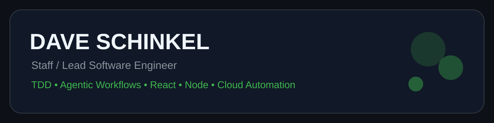
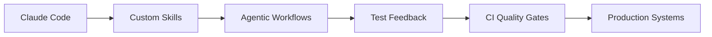

# Dave Schinkel

```txt
$ whoami

Staff / Lead Software Engineer
TDD / XP practitioner
Agentic workflow builder
React / Node / Cloud automation
```

## Current Focus

```txt
$ current-focus

custom-claude-skills
local-llm-test-loops
embedding-agents
signal-agents
prompt-evaluation-pipelines
ci-quality-gates
clean-architecture
```

## Agentic Engineering Lab

Building practical AI-assisted software delivery systems with fast feedback, executable checks, and clean boundaries.



## Contribution Roast


## Systems I Build

```txt
Custom Claude Skills
Local LLM Test Loops
Prompt Evaluation Pipelines
React / Node Platforms
CI/CD Quality Gates
Hexagonal Architecture
TDD-First Codebases
Cloud Automation
```

## Definition of Done

```txt
[✓] Tests verify important behavior
[✓] Small vertical slices
[✓] Clean domain boundaries
[✓] Fast local feedback
[✓] CI-enforced quality
[✓] Agent outputs verified by tests
```

## Tech Stack


## GitHub Activity


## Links

Website: https://WeDoTDD.com  
GitHub: https://github.com/dschinkel  
LinkedIn: https://www.linkedin.com/in/daveschinkel

<!-- profile -->
